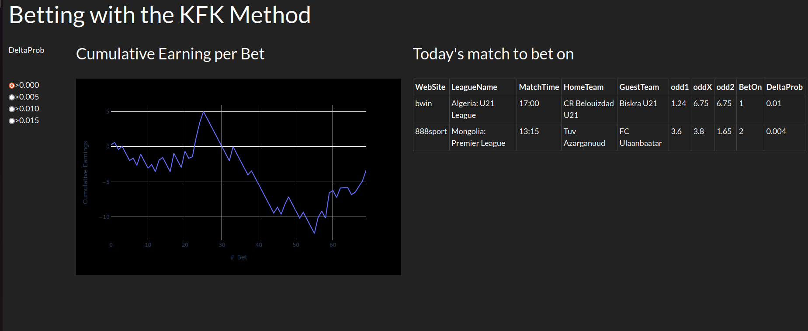

# Betting with the KFK method
This is the implementation of the method described in the paper
["Beating the bookies with their own numbers - and how the online sports betting market is
rigged"] (https://arxiv.org/abs/1710.02824)
published by Kaunitz, Zhong, and Kreiner.

## Usage
Being the work still in progress, to date the code need to be run by hand. It
scrapes four different betting sites to get the odds plus the site betexplorer.com
which provides the means from many bookmakers (usually more than 10).

## The dashboard
The dashboard is intended to show the profit from the betting history and
provides the today's soccer matches having one odd higher than the average
odd (expressed as probability). Unlike in the KFK paper, the probabilities 
has been corrected as explained in the [Kaggle 
notebook](https://www.kaggle.com/code/corrrado/beat-the-bookie-probability-correction)
in order to remove the need of the $\alpha$ parameter.

